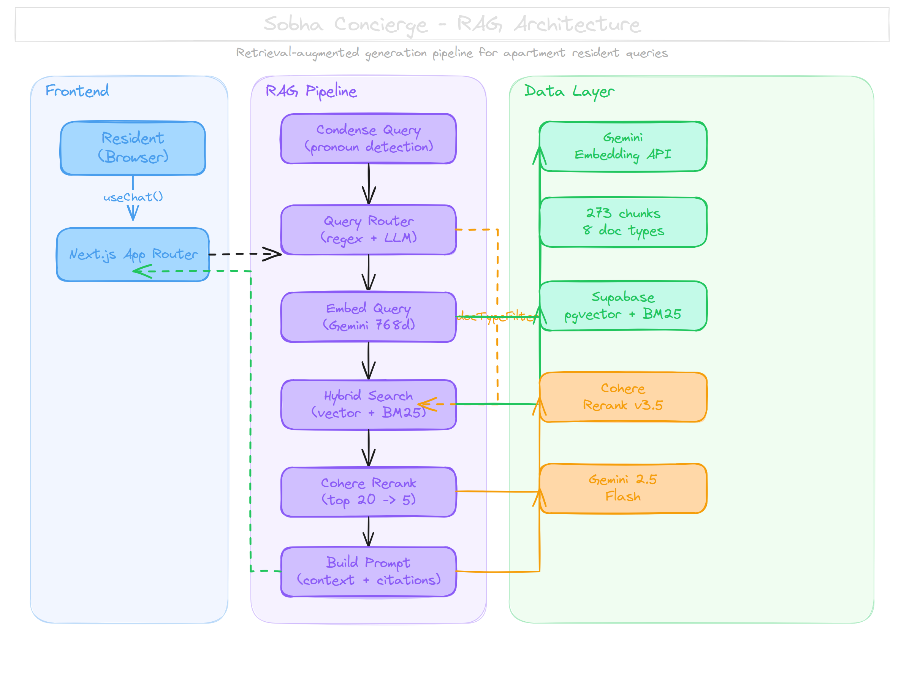
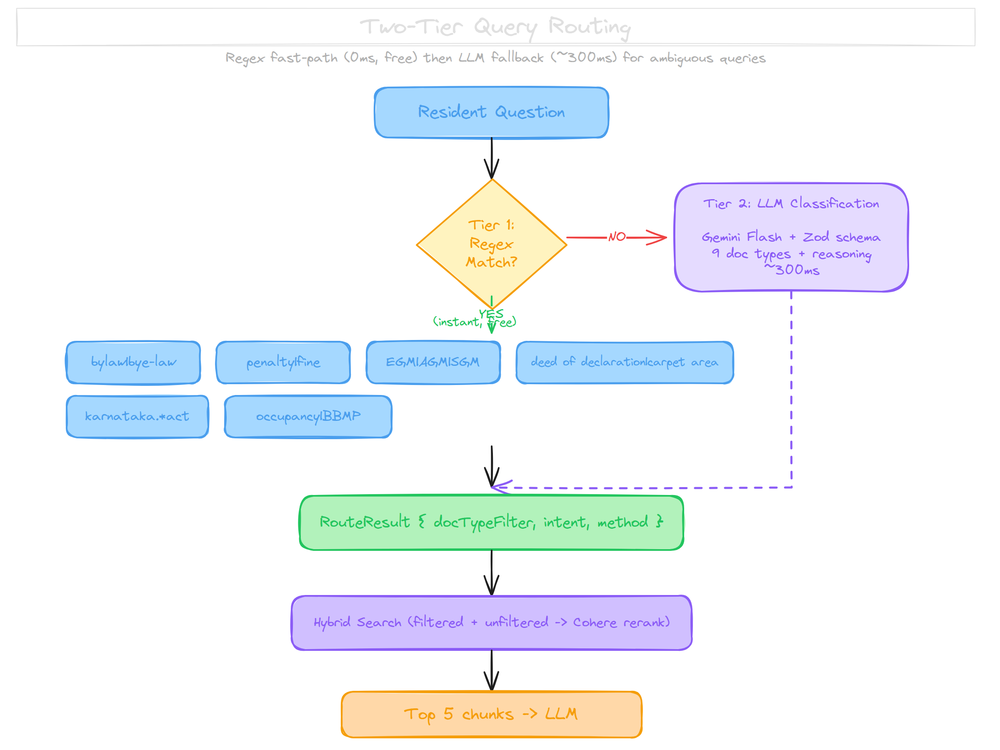
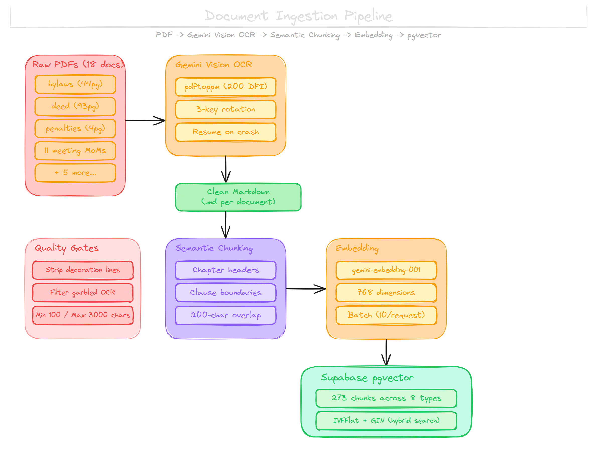

# Sobha Concierge

AI-powered concierge for residents of **Sobha Indraprastha**, a 356-unit apartment complex in Bangalore. Ask questions about bylaws, penalties, meeting decisions, property details, and more — grounded in real association documents with source citations.

Built with a RAG (Retrieval-Augmented Generation) pipeline on a free-tier stack.

## Architecture



**How it works:** A resident's question flows through query condensation (handling multi-turn context), two-tier routing (regex then LLM), hybrid search (vector cosine + BM25 full-text), Cohere reranking, and finally streaming generation with Gemini Flash — all in under 3 seconds.

## Query Routing



Queries are classified into one of 9 document types using a two-tier system:

- **Tier 1 — Regex** (0ms, free): High-confidence patterns like `bylaw`, `penalty|fine`, `EGM|AGM|SGM`, `karnataka.*act`, `occupancy|BBMP`. Catches ~60% of queries instantly.
- **Tier 2 — LLM** (~300ms): For ambiguous questions like *"Can I keep a pet?"* or *"What about the CCTV thing from last month?"*. Uses Gemini Flash with a Zod schema that returns `{ docType, reasoning }`.

The router output feeds into hybrid search as an optional filter. Results are merged (filtered + unfiltered) and Cohere reranks the combined pool — so cross-category matches aren't lost.

## Ingestion Pipeline



Documents go through: PDF → Gemini Vision OCR → clean markdown → semantic chunking → embedding → Supabase pgvector.

**Quality gates** at each stage:
- OCR: 3-key API rotation, per-page progress saves, automatic resume on crash
- Chunking: chapter/clause boundary detection, 200-char overlap, decoration line stripping, garbled-text filtering
- Storage: IVFFlat + GIN indexes, incremental ingestion (won't re-process unchanged docs)

## Corpus

| Document Type | Chunks | Source Documents |
|---|---|---|
| Bylaws | 128 | SIAOA Apartment Bylaws (44 pages) |
| Deed | 78 | Deed of Declaration (93 pages) |
| Minutes | 42 | 11 board/EGM meeting minutes |
| Act | 10 | Karnataka Apartment Ownership Act 1972 |
| Certificate | 7 | BBMP Occupancy + Completion Certificates |
| Penalties | 5 | SIAOA Penalties & Violations |
| Notice | 2 | Official notices |
| Financial | 1 | Income & Expenditure Statement |
| **Total** | **273** | **18 documents** |

## Tech Stack

| Layer | Technology | Why |
|---|---|---|
| Frontend | Next.js 16 (App Router), Tailwind, shadcn/ui | Server components, streaming UI |
| Chat | AI SDK v6 (`useChat`, `streamText`) | Framework-agnostic streaming with `UIMessage` format |
| LLM | Gemini 2.5 Flash (free tier) | Fast, capable, free |
| Embeddings | `gemini-embedding-001` (768d) | Matched to the LLM provider, free |
| Vector DB | Supabase pgvector (free tier) | Hybrid search via SQL function (cosine + BM25) |
| Reranker | Cohere Rerank v3.5 (free tier) | Dramatically improves precision (top 20 → top 5) |
| OCR | Gemini Vision API | Handles scanned PDFs with Kannada text, stamps, seals |
| Routing | AI SDK `generateText` + `Output.object()` | Structured LLM output with Zod schema validation |

**Total cost: $0.** Every service is on a free tier.

## Project Structure

```
src/
  app/
    api/chat/route.ts     # POST handler: condense → route → retrieve → stream
    chat/page.tsx          # Chat UI with useChat()
    page.tsx               # Landing page
  components/
    chat-input.tsx         # Message input with suggested questions
    chat-message.tsx       # Message bubbles with citation rendering
    suggested-questions.tsx
  lib/
    rag/
      query-router.ts     # Two-tier routing (regex + LLM)
      retriever.ts         # Hybrid search + Cohere rerank
      embeddings.ts        # Gemini embedding API (single + batch)
      prompt.ts            # System prompt + context formatting
    db/
      supabase.ts          # Client + types
scripts/
  ocr-gemini.ts            # Gemini Vision OCR pipeline (resume-capable)
  ingest.ts                # Chunking + embedding + storage pipeline
  eval.ts                  # 20-question eval framework (7 categories)
data/
  processed/               # Clean markdown files (post-OCR)
  raw/                     # Original PDFs
supabase/
  migrations/              # Schema + hybrid_search function
```

## Getting Started

### Prerequisites

- Node.js 20+
- Three API keys (all free tier):
  - [Google AI Studio](https://aistudio.google.com/) — Gemini API key
  - [Supabase](https://supabase.com/) — project URL + anon key
  - [Cohere](https://dashboard.cohere.com/) — API key for reranking

### Setup

```bash
git clone https://github.com/yashvoladoddi37/sobha-concierge.git
cd sobha-concierge
npm install
```

Create `.env.local`:

```env
GOOGLE_GENERATIVE_AI_API_KEY=your_gemini_key
NEXT_PUBLIC_SUPABASE_URL=your_supabase_url
NEXT_PUBLIC_SUPABASE_PUBLISHABLE_KEY=your_supabase_anon_key
COHERE_API_KEY=your_cohere_key
```

Run the Supabase migrations (creates tables, indexes, and the `hybrid_search` function):

```bash
npx supabase db push
```

### Ingest Documents

```bash
# OCR scanned PDFs (if you have raw PDFs)
npx tsx scripts/ocr-gemini.ts

# Ingest all documents
npx tsx scripts/ingest.ts

# Or re-ingest a specific document
npx tsx scripts/ingest.ts declaration-deed.md
```

### Run

```bash
npm run dev
```

Open [http://localhost:3000](http://localhost:3000).

### Evaluate

```bash
npx tsx scripts/eval.ts
```

Runs 20 questions across 7 categories. Checks retrieval accuracy (doc type match), keyword hit rate, and query routing correctness. Exits with code 1 if overall pass rate falls below 70%.

## Eval Results

Routing accuracy: **95%** (19/20) — regex covers obvious patterns, LLM handles the rest.

Retrieval is strong for categories with sufficient data (bylaws, minutes, certificates, legal) and will improve as remaining OCR pages land. The eval framework catches regressions automatically.

## License

MIT
